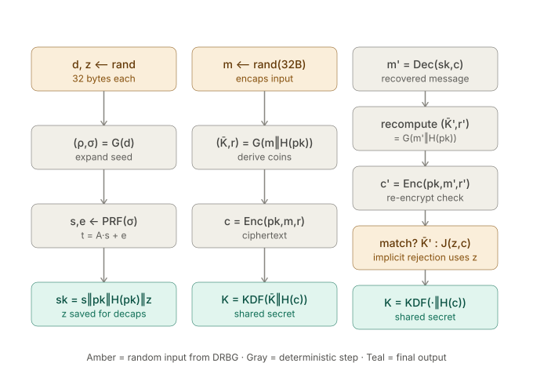
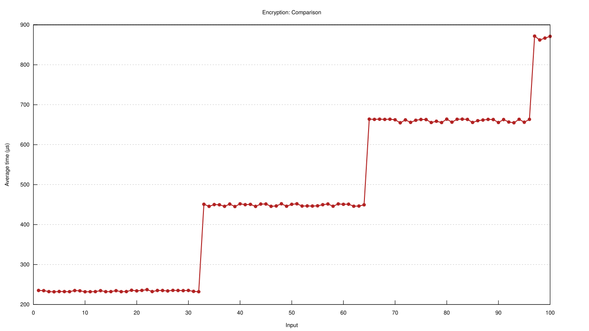
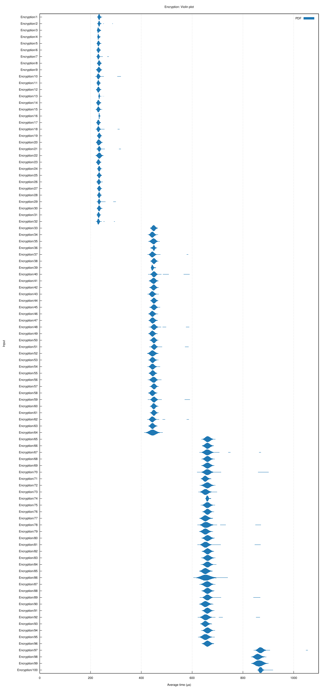
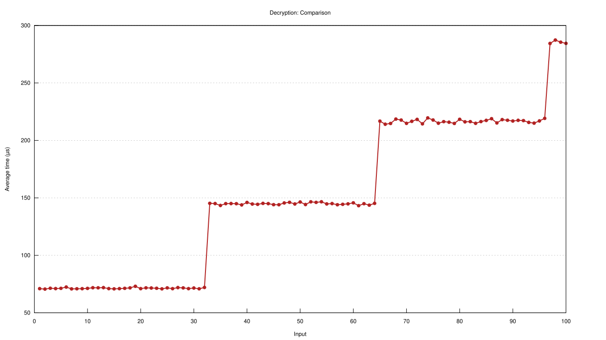
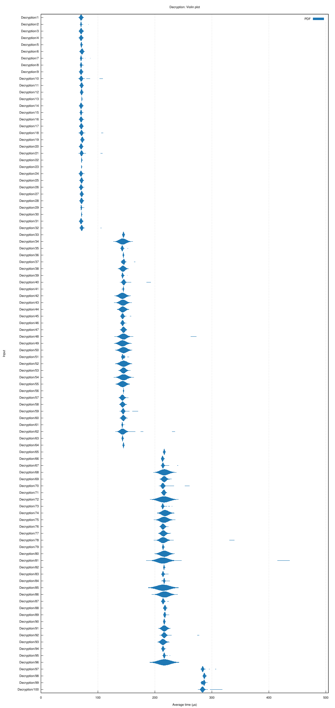
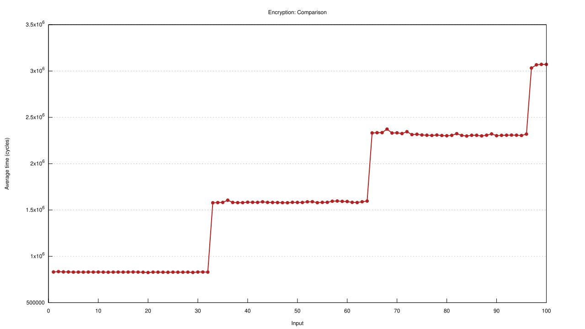
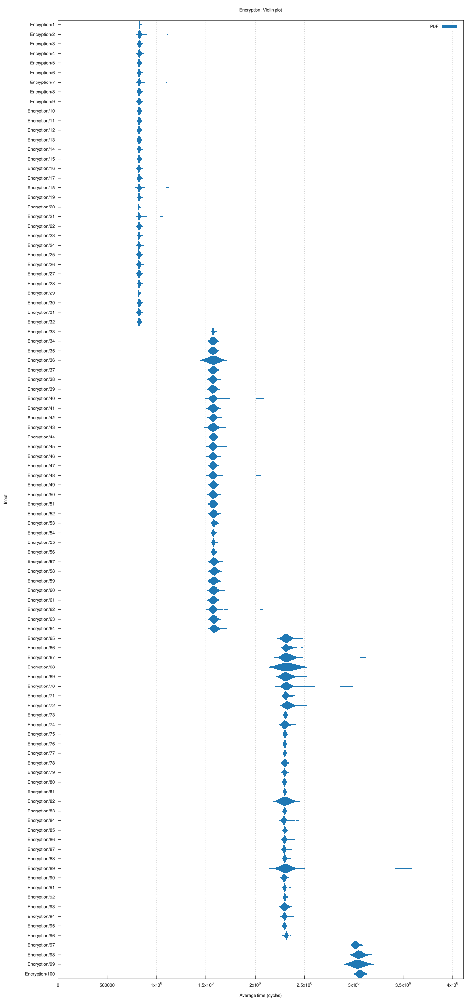
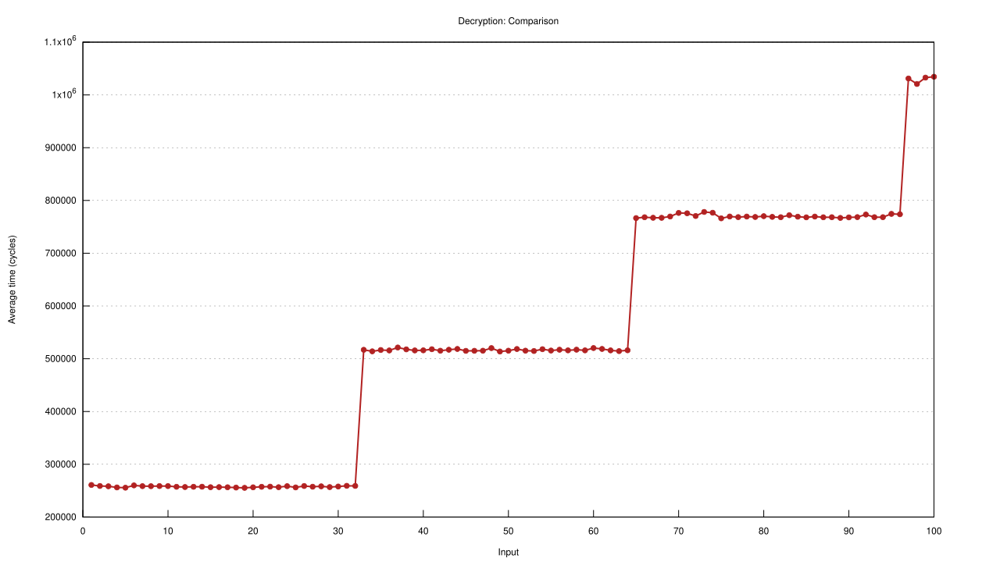
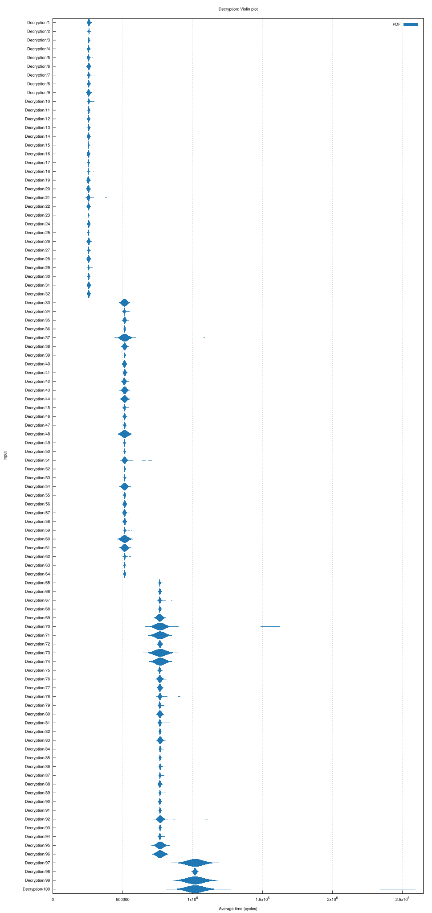

# KIBEURRE

Kibeurre is a naive kyber implementation written in Rust. The goal of this projet is to make me work on lattices/LWE and Rust, ofc :)

To try it, just `git clone https://github.com/thaaoblues/kibeurre.git` and `cd kibeurre`, finally `cargo run`.


## TOUDOU 
- voir si c'est la forme de s ou le nonce qui fait fail le test de génération de t
- voir pourquoi la decryption foire
- 
- montgomery multiplication is false ? Not giving the same result as classic one
- faire les tests sur les vecteurs de tests officiels
- clean the code


# Kyber core principles

- [Cryptograhy 101 Kyber Course](https://www.youtube.com/watch?v=9NKm84vKALc&list=PLA1qgQLL41SSUOHlq8ADraKKzv47v2yrF)

- [Kyber repository](https://github.com/pq-crystals/kyber)

# Full entropy flow



It derives from the Fujisaki Okamoto transform :
- H = SHA3-256 (32-byte output, used for H(pk) and H(c))
- G = SHA3-512 (64-byte output, split in half)
- XOF (matrix expansion, A from ρ) = SHAKE128
- PRF (noise sampling, s/e/r/e1/e2 from σ/r + nonce) = SHAKE256
- J (implicit rejection fallback in Decaps) = SHAKE256, J(z,c) if not matching else 

To understand one of the reasons why the FO:

- [link to a blog post that introduces preliminary concepts and never went further](https://xuganyu96.github.io/cryptography/2024/09/20/fujisaki-okamoto.html)

- [link to a pdf presentation explaining FO](https://hoevelmanns.net/wp-content/uploads/2024/04/Fujisaki-Okamoto-a-recipe-for-post-quantum-public-key-encryption.pdf)

- [link to a stackexchange example of a famous CCA](https://crypto.stackexchange.com/questions/12688/can-you-explain-bleichenbachers-cca-attack-on-pkcs1-v1-5)

# math_utils.rs

Contains all basic vector and matrices operations in Z/qZ and Rq :
- vectors addition
- vector scalar multiplication
- matrix multiplication (not optimised)
- Montgomery form (for Z/qZ)


## Multiplications in Z/3329Z 
- I use Montgomery method to speedup modulus computation when multiplying two numbers (sadly not by much)


# NTT (ntt.rs)

I first learned NTT throught theses ressources : 
- [Satriawan, Ardianto, et al. « A Complete Beginne Guide to the Number Theoretic Transform (NTT) ». nᵒ 2024/585, 2024, Cryptology ePrint Archive. Cryptology ePrint Archive (eprint.iacr.org), https://eprint.iacr.org/2024/585.](2024-585.pdf)

- [Cryptograhy 101 Kyber Course](https://youtu.be/ey1ND_xPITw)

- [Reducible FFT video](https://youtu.be/h7apO7q16V0)

Then implemented a naive recursive version and finally derived my algorithm from the "in place" implemetation from kyber round 3 NIST submission.
In the reference implementation pre-computed arrays of zeta powers and inverse powers are in Montgomery form. 
I prefered to let them be in the standard one and compute the Montgomery form on the fly, as i don't have another goal than self-learning and remembering easily is. Which speed optimisation can sometimes obstruct.


# Kyber core (core.rs)
- public key generation
- private key generation
- encryption/decryption
- vectors rounding
- Matrix generation from seed
- noise sampling from central binomial distribution (error vectors)
- "small" vectors sampling (absolute value of modulus < eta)


# parameters (parameters.rs)
I chose to implement ML-KEM-768.
The constant in this file are choosen accordingly (I took them from the paper).

# format_utils.rs
Usefull functions to transform a string into a set of bit vectors and a set of bit vectors back to a string

# Interactive TUI (tui.rs)
The interactive TUI has been heavily vibecoded by Gemini.
I sadly don't have time to learn ratatui and others fancy graphic libraries.
But it looks cool !

- string encryption
- string decryption
- log at each step
- checks if decryption was successful


# Ugly plots

## Test hardware informations
OS: CachyOS x86_64
Kernel: Linux 7.1.3-2-cachyos
CPU: AMD Ryzen 5 7640U (12) @ 4.97 GHz
RAM: 16Gb


## Computation time

### Encryption benchmark





## Decryption benchmark





We can see that thoses steps happen every 32 bytes of input string data. 
My deduction is that the steps are somehow due to the addition of one more Vector<> of 256 bits (represented as i32 => not optimized) to encode/decode. It would explain the "stairs" shape as we only add one vectore evevery 256 bits of input data.

The encryption time gets unstable, and that without notable exceptions, as we add vectors to input.
But still largely follows the steps pattern. 

Decryption time gets unstable too but the unstability seem to be less correlated to the input size, as this trend is present but with notable examples that are not following it, unlike encryption.
The steps are still dominating.


## CPU Cycles

### Encryption benchmark





### Decryption benchmark





# Parsing a Kyber KAT File

I was not able to find a proper "official" source stating the exact content of each test vector, so here is a cheat sheet of what I could find using a mix of LLM slop and deduction 

---

## File structure per test case

```
count = <int>
seed  = <48 bytes,  96 hex chars>   NIST AES-256 CTR-DRBG seed
pk    = <pk bytes,  hex>
sk    = <sk bytes,  hex>
ct    = <ct bytes,  hex>
ss    = <32 bytes,  64 hex chars>
```
---

## `seed`

48 bytes to feed the NIST AES-256 CTR-DRBG algorithm.

The implementation I use is provided by [Sebastian Ramacher](https://github.com/ait-crypto/nist-pqc-seeded-rng)

---

## `pk` (public key)

Layout: **`t ‖ rho`**

| Field | Size (bytes) | Size (hex chars, k=3) | Formula |
|---|---|---|---|
| `t`   | `k*384` = 1152 | 2304 | `k*256*12/8` bytes → `k*256*12/4` hex |
| `rho` | 32             | 64   | fixed |
| **total pk** | **1184** | **2368** | `k*384 + 32` |

- `t` = `A·s + e` **NTT domain**, **encoded/serialized**, 12 bits/coefficient, `k` polynomials.
- `rho` = seed used to regenerate matrix `A` via `generate_A_from_seed`.


---

## `sk` (secret/private key)

Layout: **`s ‖ pk ‖ H(pk) ‖ z`**  (i.e. `s ‖ t ‖ rho ‖ H(pk) ‖ z`)

| Field | Size (bytes) | Size (hex chars, k=3) | Formula |
|---|---|---|---|
| `s`      | 1152 | 2304 | `k*256*12/4` hex |
| `t`      | 1152 | 2304 | `k*256*12/4` hex |
| `rho`    | 32   | 64   | fixed |
| `H(pk)`  | 32   | 64   | SHA3-256 digest, fixed |
| `z`      | 32   | 64   | fixed |
| **total sk** | **2400** | **4800** | `2*(k*384) + 96` |

`s` and `t` are (as previous appearance of `t` in `pk`) represented in the **NTT domain ???**  

---

## `ct` (ciphertext)

Layout: **`u ‖ v`** (both **compressed**)

| Field | Size (bytes) | Size (hex chars, k=3) | Formula |
|---|---|---|---|
| `u` | `k*320` = 960 | 1920 | `k*256*D_U/4` hex, `D_U=10` |
| `v` | 128           | 256  | `256*D_V/4` hex, `D_V=4`   |
| **total ct** | **1088** | **2176** | `k*320 + 128` |

- `u` = compressed `NTT⁻¹(Aᵀ∘r) + e1`, 10 bits/coeff, `k` polynomials.
- `v` = compressed `tᵀ·r + e2 + ⌈q/2⌋·m`, 4 bits/coeff, single polynomial **in NTT domain ??**.

---

## `ss` (shared secret)


32 bytes / 64 hex chars. Final `K = KDF(K_b or z, H(c))` output


---

## Quick size table (all three parameter sets)

| Param | k | pk (bytes) | sk (bytes) | ct (bytes) | ss (bytes) |
|---|---|---|---|---|---|
| Kyber512  | 2 | 800  | 1632 | 768  | 32 |
| Kyber768  | 3 | 1184 | 2400 | 1088 | 32 |
| Kyber1024 | 4 | 1568 | 3168 | 1568 | 32 |

General formulas (bytes):

```
pk = 384k + 32
sk = 768k + 96        (= 2*(384k) + 96, i.e. s + t + rho + H(pk) + z)
ct = 320k + 128        (Kyber768/1024 use D_U=10/11, D_V=4/5)
ss = 32
```

---

## Field origin summary (who computes what)

| Field | Computed from |
|---|---|
| `rho`, `sigma` | `G(d)` split in half |
| `A` | `rho` | `generate_A_from_seed` |
| `s`, `e` | `PRF(sigma, nonce)` via CBD |
| `t` | `A·s + e` | -- |
| `H(pk)` | `SHA3-256(t ‖ rho)` | `
| `K_b`, `coins (r)` | `G(m ‖ H(pk))` | 
| `u`, `v` | encrypt(`A, t, m, r`) | 
| `H(c)` | `SHA3-256(u ‖ v)` compressed | 
| `ss` (K) | `KDF(K_b or z, H(c))` |